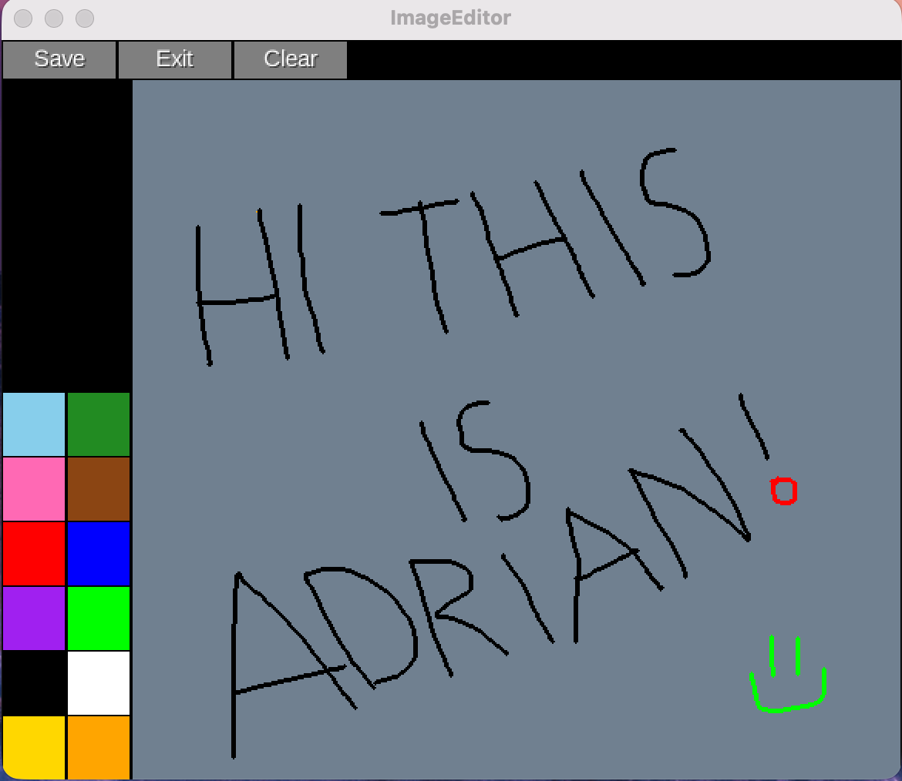

# BitMap-Canvas

### A project built for a Computer Architecture class using a graphic library and following game development frameworks.

**BitMap-Canvas** provides a simple yet effective drawing surface for sketching, annotation, and basic image editing. This project is a demonstration of clean architecture, multi-module Gradle configuration, and cross-platform Java development.

---

## Demo

<div align="center">

<br>
<br>

<br>
</div>

---
## Features

This application is designed to be an intuitive, feature-rich digital workspace for quick creative tasks.

| Feature | Description |
| :--- | :--- |
| **Drawing Tools** | Comprehensive brush and stroke controls, including adjustable size and color palette. |
| **Image Loading** | Ability to load external images onto the canvas for annotation, tracing, or editing. |
| **Canvas Manipulation** | Features for clearing the canvas and resetting the drawing surface instantly. |
| **Cross-Platform** | Built using Gradle and LibGDX to ensure identical performance across Windows, macOS, and Linux. |

---

## How to Run

Since this is a multi-module project, use the **Gradle Wrapper** to launch the desktop application.

### For macOS and Linux

1.  Open your terminal in the project folder.
2.  If needed, grant permission:
    ```bash
    chmod +x gradlew
    ```
3.  Run the app:
    ```bash
    ./gradlew desktop:run
    ```
<!-- Just in case they Mac Issues (I ran into them) -->
**macOS Troubleshooting:**
If you encounter a `zsh: operation not permitted` or `permission denied` error even after using `chmod`, it is likely due to macOS security flags. Run the following command to trust the wrapper script:
```bash
xattr -d com.apple.quarantine gradlew
```

### For Windows

1.  Open Command Prompt or PowerShell in the project folder.
2.  Run the app:
    ```bash
    .\gradlew.bat desktop:run
    ```

---

## Project Structure
```
BitMap-Canvas/
├── assets/           #All resources, images used.
├── core/
│   └── src/.         # Main program logic in Java. Platform-Independent
├── desktop/
│   └── src/.         # Desktop Launcher to run application
├── build.gradle
├── settings.gradle
├── .gitignore        # Files and folders to be excluded from version control
└── README.md
```

---

## License

This project is distributed under the **MIT License**. See the `LICENSE` file for more details.

---

## Contact

**Adrian Ninanya**

* **GitHub**: [AdrianNinanya32](https://github.com/AdrianNinanya32)
* **Linkedin**: [Adrian Ninanya](https://www.linkedin.com/in/adrian-ninanya/)
* **Project Link**: [https://github.com/AdrianNinanya32/BitMap-Canvas](https://github.com/AdrianNinanya32/BitMap-Canvas)